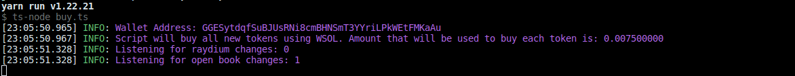

# Hobo Sniper: De Boden Multiplier
In a world where the swift nab the riches, Hobo Sniper emerges as your go-to bot for amassing Boden tokens with uncanny speed. Conceived in the digital alleys of the Solana blockchain, this script is not just software; it's your ticket to the fast lane of token accumulation. Picture it as your loyal, albeit slightly rogue, companion in the high-stakes world of cryptocurrency.

Hobo Sniper prances around the new raydium USDC/SOL pools, waiting for just the right moment. As soon as a liquidity pool flings open its doors, it pounces, swapping a fixed amount of USDC/SOL for the token, often beating the crowds (and even Raydium's UI) to the punch.

## Quickstart
```bash
git clone git@github.com:hobot-network/hobo-sniper.git
cd hobot-sniper
```

### Make a copy of the enviroment variables
```bash
cp .env.example .env
```

- Add your private key in Base58 format. Will add a script that helps you do this or upgrade later. 

Look bellow for more info on the `.env` file settings.

### Run the bot
```bash
yarn buy
```


## Gear Up for the Heist
Before you unleash Hobo Sniper, you need to prep your digital getaway car:
- Forge a new Solana wallet in the depths of cyberspace.
- Fuel it with some SOL.
- Transform a portion of your SOL into USDC or WSOL, based on the script's blueprint.
- Tailor the script to your liking by editing `.env.example` (ditch the `.copy` extension when you're done):
  - PRIVATE_KEY (the secret to your wallet's heart)
  - RPC_ENDPOINT (the digital roads it'll travel)
  - RPC_WEBSOCKET_ENDPOINT (the script's ears on the blockchain)
  - QUOTE_MINT (the currency of your choice, USDC or WSOL)
  - QUOTE_AMOUNT (how much you're willing to bet on each token)
  - COMMITMENT_LEVEL
  - USE_HOBO_LIST (focus your sights on specific tokens listed in `snipe-list.txt`)
  - HOBO_LIST_REFRESH_INTERVAL (how often to update your target list)
  - CHECK_IF_MINT_IS_RENOUNCED (only engage if the token's creators have stepped back)
- Summon the dependencies with a chant (`npm install`).
- Launch the script into the night with `npm run buy`.

Your console will light up with the tokens you've snatched:


## Whitelist
By default, Hobo Sniper is a free spirit, chasing after every new token pool it detects. But for those moments when you're hunting a specific prey during its launch event:
- Set `USE_HOBO_LIST` to `true`.
- Mark the mint addresses of your targets in `whitelist.txt`, each on a new line.

This narrows the bot's focus to only the tokens you desire, ignoring all others. The list can be updated on the fly, with Hobo Sniper checking for new additions at intervals set by `HOBO_LIST_REFRESH_INTERVAL`.

Ensure the pool is fresh; Hobo Sniper strikes only at the birth of a pool.

## The Escape Plan
Hobo Sniper usually waits for your signal to offload the tokens. If you prefer an automated getaway:
- Flip `AUTO_SELL` to `true`.
- Set `SELL_DELAY` to the time you want to wait before dumping the tokens.

This feature is still in its rogue experimental phase. Use it wisely, as the markets are wild and unpredictable. The developer, Tommy from hobot.network, washes their hands of any misadventures or misfortunes that may befall you.

## Troubleshooting the Heist
If you have an error which is not listed here, please create a new issue in this repository.

### Empty transaction
- If you see empty transactions on SolScan most likely fix is to change commitment level to `finalized`.

### Unsupported RPC node
- If you see following error in your log file:  
  `Error: 410 Gone:  {"jsonrpc":"2.0","error":{"code": 410, "message":"The RPC call or parameters have been disabled."}, "id": "986f3599-b2b7-47c4-b951-074c19842bad" }`  
  it means your RPC node doesn't support methods needed to execute script.
  - FIX: Change your RPC node. You can use Helius or Quicknode.

### No token account
- If you see following error in your log file:  
  `Error: No SOL token account found in wallet: `  
  it means that wallet you provided doesn't have USDC/WSOL token account.
  - FIX: Go to dex and swap some SOL to USDC/WSOL. For example when you swap sol to wsol you should see it in wallet as shown below:
